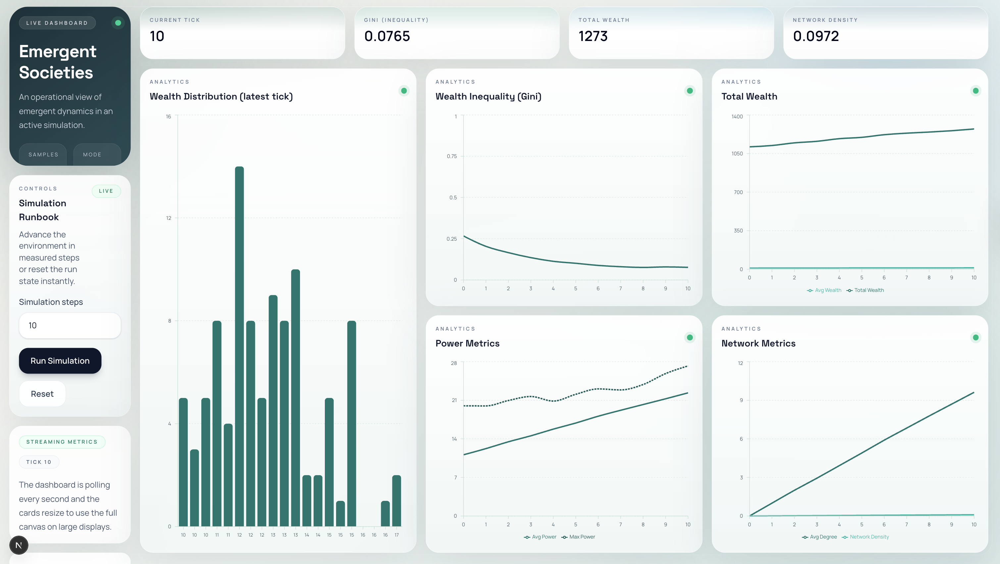

# Emergent Societies



Emergent Societies is an AI-driven multi-agent simulation platform that explores how cooperation, inequality, and power dynamics emerge in complex systems.

The system models autonomous agents that interact, trade, compete, and form relationships under different economic and environmental conditions.

This project combines simulation design, backend systems, and real-time visualization to study emergent behavior at scale.

## Live Demo

Frontend: https://emergent-societies.vercel.app  
Backend API: https://emergent-societies.onrender.com

## Backend Cold Start Notice

The backend is deployed on Render's free tier, which may enter a sleep state after inactivity.

- Initial requests may take ~30–60 seconds due to cold start
- Subsequent interactions will respond normally

If the dashboard does not load immediately, please allow time for the service to wake.

## The repo includes:

- A Python simulation engine (agents, environment, metrics, policies)
- A FastAPI backend that exposes live metrics and simulation controls
- A Next.js dashboard for real-time visualization

## Current Capabilities

- Agent-to-agent interactions with trust, memory, and relationship tracking
- Pairwise cooperate/defect decisions using pluggable policies
- Policy modes:
  - Deterministic stochastic-tendency policy
  - LLM policy through an OpenAI-compatible chat completions API
- Environment dynamics:
  - Scarcity-based resource decay and reward suppression
  - Configurable redistribution between richer/poorer pairs
  - Optional elite advantage multiplier
- Metrics and analytics:
  - Gini coefficient
  - Total and average wealth
  - Average and max power
  - Network degree and density from interaction graph
- Real-time dashboard with polling, run/reset controls, and chart visualizations

## Why This Project Matters

Understanding emergent behavior is critical in fields like:

- Economics (wealth inequality, redistribution)
- AI systems (multi-agent coordination)
- Social networks (trust and cooperation dynamics)

This project simulates these dynamics in a controlled environment, allowing experimentation with policies and agent behaviors.

## Key Highlights

- Designed a multi-agent simulation engine modeling trust, cooperation, and resource exchange
- Implemented both deterministic and LLM-driven decision policies
- Built a FastAPI backend for real-time simulation control and metrics
- Developed a Next.js dashboard for live visualization of economic and network metrics
- Simulated wealth inequality using Gini coefficient and redistribution policies
- Explored emergent behavior under scarcity, elite advantage, and policy variations

## Architecture

- simulation/: Core domain logic (Agent, Environment, policies, run loop)
- metrics/: Economic and network metrics helpers
- dashboard_backend/: FastAPI app exposing metrics and control endpoints
- dashboard/: Next.js frontend that consumes backend metrics

## Setup

### 1 Python environment

Install backend/simulation dependencies:

```bash
python -m venv .venv
source .venv/bin/activate
pip install -r requirements.txt
```

Current Python dependencies in requirements.txt:

- fastapi
- uvicorn[standard]

### 2 Dashboard dependencies

```bash
cd dashboard
npm install
```

## Run Options

### Option A: Run simulation script only

```bash
source .venv/bin/activate
python main.py
```

This runs the simulation loop from main.py using SimulationConfig defaults.

### Option B: Run full stack (backend + dashboard)

In terminal 1 (project root):

```bash
source .venv/bin/activate
uvicorn dashboard_backend.main:app --reload --host 0.0.0.0 --port 8000
```

In terminal 2:

```bash
cd dashboard
npm run dev
```

Open http://localhost:3000.

## Backend API

Base URL: http://localhost:8000

- GET /metrics
  - Returns full metrics history (including an initial tick-0 snapshot)
- POST /run
  - Runs the environment for N steps
  - Accepts either JSON body {"steps": <int>} or query parameter ?steps=<int>
- POST /reset
  - Recreates environment state and resets metric history

## Configuration

Simulation behavior is configured through SimulationConfig in simulation/config.py.

Important fields include:

- num_agents, num_steps
- initial_resources, resource_distribution (uniform or random)
- scarcity_level
- communication_enabled
- trade_threshold, redistribution_strength
- enable_elite_advantage, elite_advantage_factor
- policy_type (deterministic or llm)
- llm_model, llm_api_base_url, llm_timeout

### LLM Policy Notes

When policy_type is set to llm, each agent gets its own LLMPolicy instance. The policy uses an OpenAI-compatible chat completions endpoint.

Auth env vars:

- OPENAI_API_KEY (preferred)
- LLM_API_KEY (alias)

For local providers (for example localhost endpoints), an API key is not required.

## Key Files

- main.py: CLI simulation entrypoint
- simulation/agent.py: Agent model with memory/trust/trade/communication
- simulation/environment.py: Pairing, interaction dynamics, rewards, redistribution
- simulation/policies/deterministic_policy.py: Non-LLM decision policy
- simulation/policies/llm_policy.py: LLM decision policy and response parsing
- dashboard_backend/main.py: FastAPI app for metrics and simulation controls
- dashboard/app/page.tsx: Main dashboard UI
- dashboard/lib/api.ts: Frontend API client

## Project Structure

```text
emergent-societies/
├── assets/
├── main.py
├── requirements.txt
├── simulation/
│   ├── agent.py
│   ├── config.py
│   ├── environment.py
│   ├── simulation.py
│   └── policies/
│       ├── deterministic_policy.py
│       └── llm_policy.py
├── metrics/
│   ├── economics.py
│   └── metrics.py
├── dashboard_backend/
│   └── main.py
└── dashboard/
    ├── app/
    ├── components/
    └── lib/
```


## Related Docs

- AGENT_DOCUMENTATION.md: Agent API details
- docs/experiments.md: Experiment notes

